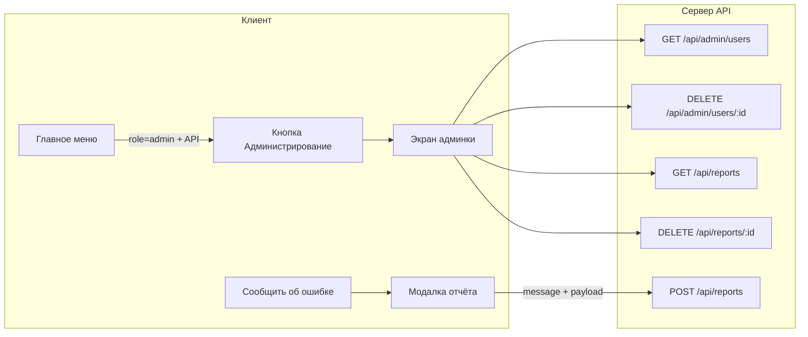

# План: Администратор Panko и панель администрирования

## Контекст

- **Аутентификация:** в режиме API — JWT и серверная БД (SQLite, [server/db.js](server/db.js)); пользователи в таблице `users` (id, username, password_hash, role).
- **Меню:** главный экран — [index.html](index.html) (кнопки по группам), подменю строится из [js/core/menu.js](js/core/menu.js) (`MENU_GROUPS`). Видимость кнопки «Администрирование» нужно привязать к роли и режиму API (например, в [js/core/users.js](js/core/users.js) в `updateAuthBar()` или при отрисовке меню).
- **Роли:** уже есть `requireRole('admin', ...)` в [server/auth.js](server/auth.js); на клиенте — `getCurrentUser().role`.

---

## 1. Пользователь Panko на сервере

- **Где:** при старте сервера после `initSchema()` в [server/server.js](server/server.js).
- **Логика:** если пользователя с логином `Panko` нет (`!db.findUserByUsername('Panko')`), создать его через `db.createUser(id, 'Panko', bcrypt.hashSync('123456', 10), 'admin')`. ID — например `u_admin_panko` или сгенерированный.
- **Важно:** использовать уже подключаемый в [server/routes/auth.js](server/routes/auth.js) `bcrypt` (или подключить в server.js только для сида).

---

## 2. Кнопка «Администрирование» в главном меню

- **Условие показа:** только при `getCurrentUser().role === 'admin'` и `window.CATTLE_TRACKER_USE_API` (управление пользователями и отчёты имеют смысл только при работе с сервером).
- **Реализация:**
  - В [index.html](index.html) добавить блок с кнопкой «Администрирование» (например, новая `menu-section` с `id="admin-menu-section"`), по клику — `navigate('admin')`. Изначально скрыть блок (например, `style="display: none;"` или класс).
  - В [js/core/users.js](js/core/users.js) в функции `updateAuthBar()` после обновления auth-bar выставлять видимость `#admin-menu-section`: `display = (user && user.role === 'admin' && window.CATTLE_TRACKER_USE_API) ? '' : 'none'`. Так кнопка появится только у админа в режиме API и исчезнет после выхода.

---

## 3. Экран «Администрирование» (админ-панель)

- **Новый экран:** в [index.html](index.html) добавить `
` с:
  - заголовком «Администрирование»;
  - секцией «Пользователи»: контейнер для списка (таблица или список), у каждой записи — логин, роль, дата (если есть), кнопка «Удалить»; запрет удаления текущего пользователя (по id);
  - секцией «Отчёты пользователей»: контейнер для списка сообщений (дата, автор, текст, приложенные данные), при необходимости — кнопка «Удалить» у каждого отчёта;
  - кнопкой «Назад» → `navigate('menu')`.
- **Инициализация при открытии:** в [js/core/menu.js](js/core/menu.js) в `navigate()` для `screenId === 'admin'` вызывать функцию инициализации экрана админки (загрузка списка пользователей и отчётов через API, привязка кнопок удаления).
- **Логика экрана:** отдельный модуль/файл (например, `js/features/admin.js` или логика в `menu.js`): при открытии экрана — `GET /api/admin/users` и `GET /api/reports`, отрисовка списков; удаление пользователя — `DELETE /api/admin/users/:id` с подтверждением; удаление отчёта — `DELETE /api/reports/:id`. Ошибки выводить через существующий тост/сообщение.

---

## 4. API сервера для админки и отчётов

**Список и удаление пользователей (только admin):**

- В [server/db.js](server/db.js):
  - Добавить `getAllUsers()` — выборка из `users` (id, username, role, created_at), без password_hash.
  - Добавить `deleteUser(id)` — удаление по id; при необходимости проверять, что не удаляется последний admin.
- Новый роут (например, [server/routes/admin.js](server/routes/admin.js) или в существующем файле):
  - `GET /api/admin/users` — `requireAuth`, `requireRole('admin')`, ответ: массив пользователей из `getAllUsers()`.
  - `DELETE /api/admin/users/:id` — `requireAuth`, `requireRole('admin')`, запрет удаления себя (`req.user.id === req.params.id`), вызов `db.deleteUser(id)`.

**Хранение и API отчётов пользователей:**

- В [server/db.js](server/db.js):
  - Таблица `reports`: id (TEXT или INTEGER), user_id, username, message TEXT, payload_json TEXT (диагностика), created_at. Добавить в `initSchema()` создание таблицы (или миграцию, если нужно не трогать старые БД).
  - Функции: `createReport(userId, username, message, payloadJson)`, `getReports()` (все, для админа), `deleteReport(id)`.
- Роуты отчётов (тот же [server/routes/admin.js](server/routes/admin.js) или отдельный [server/routes/reports.js](server/routes/reports.js)):
  - `POST /api/reports` — `requireAuth`, тело: `{ message, payload? }`. Сохранять user_id и username из `req.user`, message и payload (JSON.stringify в payload_json). Ответ — созданный отчёт или ok.
  - `GET /api/reports` — `requireAuth`, `requireRole('admin')`, возврат списка отчётов из `getReports()`.
  - `DELETE /api/reports/:id` — `requireAuth`, `requireRole('admin')`, вызов `db.deleteReport(id)`.

В [server/server.js](server/server.js) подключить новые роуты и при необходимости префикс (например, `/api/admin` для admin, `/api` для reports).

---

## 5. Кнопка «Сообщить об ошибке» и отправка отчёта

- **Где показывать:** в шапке приложения ([index.html](index.html), [id="app-header"]) рядом с кнопкой настроек подключения или в подменю «Настройки». Имеет смысл показывать только при `CATTLE_TRACKER_USE_API` и авторизованном пользователе.
- **Поведение:** по нажатию открывать модальное окно (или отдельный маленький экран): поле ввода текста сообщения, опция «Приложить диагностику» (по умолчанию включена). При отправке:
  - Собирать диагностику (если включена): версия приложения, userAgent, текущий экран (hash), размер localStorage (или факт переполнения), последняя ошибка из `window`/обработчика ошибок — если есть; формат — объект, сериализуемый в JSON.
  - Вызов `POST /api/reports` с телом `{ message, payload }`. После успеха — закрыть модалку и показать тост «Сообщение отправлено».
- **Реализация:** обработчик и сбор диагностики можно оформить в том же модуле, где экран админки (например, `js/features/admin.js`), или в отдельном `js/features/report-error.js`; вызов API — через существующий api-client или отдельный метод в [js/api/api-client.js](js/api/api-client.js) (например, `submitReport(message, payload)`).

---

## 6. Зависимости и дублирование

- **Электрон:** в проекте используется копирование из корня в electron при сборке ([electron/copy-web.js](electron/copy-web.js)); правки в корневом [index.html](index.html) и в `js/` автоматически попадут в сборку. Отдельно правки в `electron/index.html` не требуются, если сборка всегда идёт из корня.
- **Стили:** при необходимости добавить классы для экрана админки и модалки «Сообщить об ошибке» в [css/style.css](css/style.css) (или существующие классы форм/кнопок переиспользовать).

---

## Порядок внедрения (рекомендуемый)

1. Сервер: таблица `reports`, функции в db (getAllUsers, deleteUser, createReport, getReports, deleteReport), сид Panko в server.js, роуты admin и reports, подключение в server.js.
2. Клиент: методы API в api-client (getUsers, deleteUser, submitReport, getReports, deleteReport).
3. Клиент: кнопка «Администрирование» в index.html + логика видимости в updateAuthBar; экран admin-screen в index.html + инициализация в menu.js + логика загрузки/удаления в admin.js (или аналог).
4. Клиент: кнопка «Сообщить об ошибке» в шапке/настройках, модалка, сбор диагностики, вызов submitReport.
5. Проверка: вход как Panko, появление кнопки «Администрирование», просмотр/удаление пользователей и отчётов; вход как обычный пользователь — отправка отчёта и появление его в админке.

---

## Схема потоков

