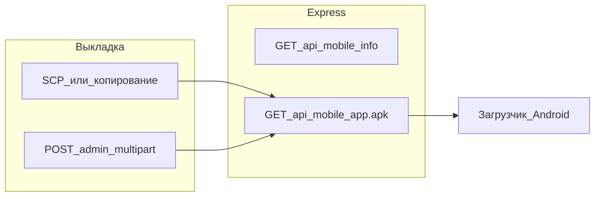

# APK на сервере и кнопка в «Синхронизация»

## Ответ на вопрос «можно ли выгружать на сервер»

Да. Практичные варианты:

1. **Без доработки API (вручную):** после сборки APK копировать файл на VPS в каталог рядом с сервером (например `server/data/mobile/cattle-tracker-latest.apk`) и отдавать его через новый маршрут Express — ниже.
2. **С доработкой API (удобнее админу):** добавить **admin-only** `POST` с `multipart/form-data` (потребуется зависимость вроде `multer` в [server/package.json](e:/VScode/cattle-tracker/server/package.json)), чтобы заливать APK по токену без SSH. За прокси (Nginx) нужно увеличить лимит тела запроса (`client_max_body_size`), иначе большие APK отрежутся.

Рекомендация: начать с **ручной выкладки файла** + `GET` для скачивания; загрузку через API добавить вторым шагом, если нужно.

## Сервер (Express)

- **Каталог хранения:** например `[server/data/mobile/](e:/VScode/cattle-tracker/server/data)` (создавать при старте, как уже делается для `dataDir`). Файл в `.gitignore` (сами APK не коммитить), можно оставить `.gitkeep`.
- **Маршруты (публичное чтение, без JWT — как у `/api/health`):**
  - `GET /api/mobile/info` — JSON: есть ли файл, размер, опционально `version` из рядом лежащего `version.json` (заполняется при выкладке вручную или при upload).
  - `GET /api/mobile/app.apk` — `res.sendFile` с заголовками `Content-Type: application/vnd.android.package-archive` и `Content-Disposition: attachment; filename="..."`. Если файла нет — `404` с JSON `{ error: '...' }`.
- **Подключение:** новый роутер (например `server/routes/mobile.js`) и `app.use` в [server/server.js](e:/VScode/cattle-tracker/server/server.js) **до** общего JSON error-handler. Лимитеры из [server/routes/auth.js](e:/VScode/cattle-tracker/server/routes/auth.js) на эти пути не распространяются — отдельная проблема не ожидается.

## Клиент: экран «Синхронизация»

- **Разметка:** в [index.html](e:/VScode/cattle-tracker/index.html) и зеркале [electron/index.html](e:/VScode/cattle-tracker/electron/index.html) внутри `#sync-screen` добавить секцию (например после `#sync-server-block` или внутри него), с подсказкой и кнопкой «Скачать APK с сервера».
- **Когда показывать кнопку:** только если есть базовый URL API — `window.CattleTrackerApi && typeof CattleTrackerApi.getBaseUrl === 'function' && CattleTrackerApi.getBaseUrl()` (тот же источник, что и остальной API в [js/api/api-client.js](e:/VScode/cattle-tracker/js/api/api-client.js)). Дополнительно скрывать на не-Android: проверка `window.Capacitor?.getPlatform?.() === 'android'`, чтобы на iOS/Desktop не показывать бессмысленную кнопку.
- **Поведение по нажатию:**
  1. Опционально: `fetch(base + '/api/mobile/info')` — если `available === false`, показать toast «На сервере нет файла обновления».
  2. Открыть прямую ссылку `base + '/api/mobile/app.apk'` **вне WebView**, чтобы сработал системный загрузчик: добавить `**@capacitor/browser`**, вызов `Browser.open({ url })` (динамический `import()`, по аналогии с [@capacitor/app в js/main.tsx](e:/VScode/cattle-tracker/js/main.tsx)), затем `npx cap sync android`.
- **Логика:** вынести в небольшой модуль (например `js/features/sync/sync-mobile-apk.js`) и подключить из фасада [js/features/sync.js](e:/VScode/cattle-tracker/js/features/sync.js); то же для [electron/js/features/sync.js](e:/VScode/cattle-tracker/electron/js/features/sync.js) при необходимости паритета.

## Сопутствующее

- После реализации кода — по правилам репозитория: поднять patch в корневом [package.json](e:/VScode/cattle-tracker/package.json) (`version`), `npm run version:sync`, сборка `npm run installer` (уже в workflow проекта).
- Тесты: при желании — один запрос к `GET /api/mobile/info` без файла (ожидание 404 или `{ available: false }` в зависимости от выбранного контракта).

