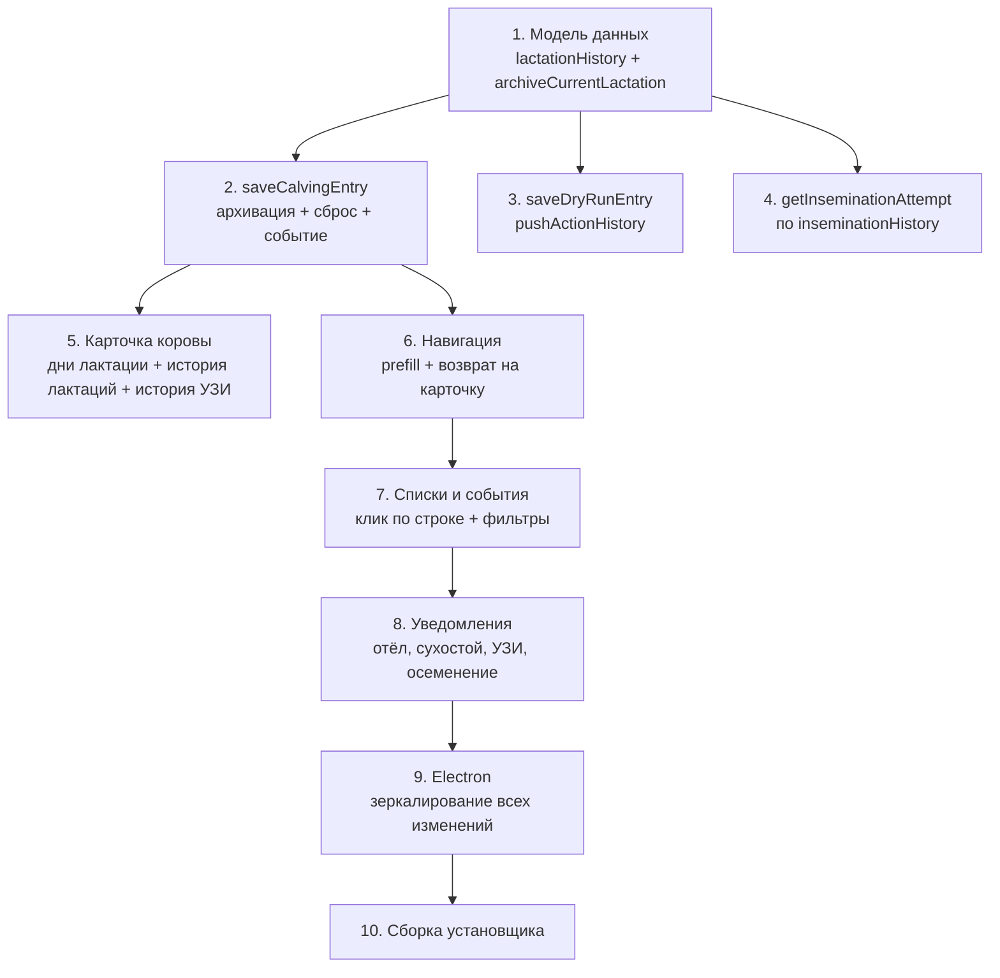

# Переработка модели данных и исправление нестыковок в cattle-tracker

## Обзор

Текущая модель данных хранит только последние значения (`calvingDate`, `dryStartDate`, `inseminationDate`) — при новом отёле данные предыдущих лактаций **теряются**. Необходимо ввести полактационное хранение через массив `lactationHistory` и исправить все найденные нестыковки между экранами.

---

## ЧАСТЬ 1. Модель данных — полактационное хранение

### Новая структура данных

В `entry` добавляется поле `lactationHistory` — массив завершённых лактаций:

```javascript
entry.lactationHistory = [
  {
    number: 1,                    // номер лактации
    calvingDate: '2024-01-15',    // дата отёла (завершение этой лактации)
    dryStartDate: '2023-11-01',   // дата запуска
    dryDuration: 75,              // длительность сухостоя (дней)
    inseminationDate: '2023-05-10', // последнее осеменение
    attemptNumber: 2,
    bull: 'Бык1',
    inseminator: 'Вет1',
    code: '123',
    inseminationHistory: [...],   // осеменения этой лактации
    uziHistory: [...],            // УЗИ этой лактации
    status: 'Отёл',               // финальный статус
    protocol: { name: '', startDate: '' }
  },
  // ...ещё лактации
];
```

Текущие поля (`inseminationDate`, `inseminationHistory`, `uziHistory`, `dryStartDate`, `status`, `protocol`) продолжают отвечать за **текущую (незавершённую) лактацию**. `actionHistory` остаётся глобальным.

### Что происходит при отёле (автоматически)

**Файл:** [js/ui/cow-operations.js](js/ui/cow-operations.js) — `saveCalvingEntry()`

При сохранении отёла:

1. **Создать снимок текущей лактации** → push в `entry.lactationHistory`
2. **Инкрементировать** `entry.lactation` (+1)
3. **Записать** `pushActionHistory(entry, 'Отёл', detailsStr, { eventType: 'Отёл' })`
4. **Сбросить поля** для новой лактации:
  - `inseminationDate = ''`, `attemptNumber = 1`, `bull = ''`, `inseminator = ''`, `code = ''`
  - `inseminationHistory = []`, `uziHistory = []`
  - `dryStartDate = ''`
  - `protocol = { name: '', startDate: '' }`
5. **Установить** `entry.calvingDate = newCalvingDate`, `entry.status = 'Отёл'`

Вычисляемые поля в снимке:

- `dryDuration` = `calvingDate - dryStartDate` (дней), если оба заполнены

**Новая функция** `archiveCurrentLactation(entry, newCalvingDate)` в [js/storage/storage-entries.js](js/storage/storage-entries.js).

### Миграция существующих данных

**Файл:** [js/storage/storage-entries.js](js/storage/storage-entries.js) — `loadLocally()`

- Если `entry.lactationHistory === undefined` → `entry.lactationHistory = []`
- Существующие данные остаются как «текущая лактация» — обратная совместимость полная

### Исправление `getInseminationAttempt`

**Файл:** [js/features/insemination.js](js/features/insemination.js)

Текущая реализация ищет по `entries` (строки 15-28) — работает некорректно (находит максимум 1 запись). 

**Исправление:** `attemptNumber = entry.inseminationHistory.length + 1` — теперь `inseminationHistory` содержит только осеменения текущей лактации (сбрасывается при отёле).

---

## ЧАСТЬ 2. Отображение в карточке коровы

### Дни лактации

**Файл:** [js/features/view-cow.js](js/features/view-cow.js)

Добавить поле **«Дни лактации»** = разница от `entry.calvingDate` до сегодня (в днях).

### Блок «История лактаций»

В карточке коровы добавить раскрывающуюся секцию **«История лактаций»** (по аналогии с «Все осеменения»):

Для каждой лактации из `lactationHistory` показать:

- Номер лактации
- Дата отёла
- Длительность сухостоя (дней)
- Количество осеменений / попытка
- Результат УЗИ
- Бык / осеменатор

Также добавить секцию **«История УЗИ»** текущей лактации (аналогично таблице осеменений).

### Кнопка «Осеменение» в карточке

**Файл:** [js/features/view-cow.js](js/features/view-cow.js) (строки 217-222)

Добавить кнопку `💉 Осеменение` с `_prefillCattleId + navigate('insemination')`.

---

## ЧАСТЬ 3. Исправление нестыковок (из первоначального плана)

### Критичные

**3.1. Запуск в сухостой — нет события**

- [js/ui/cow-operations.js](js/ui/cow-operations.js), `saveDryRunEntry()` — добавить `pushActionHistory(entry, 'Запуск в сухостой', detailsStr, { eventType: 'Запуск в сухостой' })`

**3.2. Экран осеменения — нет prefill**

- [js/features/insemination.js](js/features/insemination.js) — добавить `initInseminationScreen()` с чтением `_prefillCattleId` → `cattleIdInsemInput`
- [js/core/menu.js](js/core/menu.js) — добавить вызов `initInseminationScreen` при `screenId === 'insemination'`

**3.3. Electron: pushActionHistory без options**

- [electron/js/storage-entries.js](electron/js/storage-entries.js) — синхронизировать с 4-аргументной версией из `js/storage/storage-entries.js`

### Средние (UX)

**3.4. Навигация после сохранения**

- Осеменение (`addInseminationEntry`) — нет навигации, добавить
- Отёл, Запуск, Протокол → `navigate('menu')` вместо карточки
- **Решение:** ввести `window._returnToViewCow = cattleId` при переходе из карточки; после сохранения проверять: если задан — `viewCow(cattleId)`, иначе `navigate('menu')`

**3.5. Клик по строке в списках**

- [js/features/lists.js](js/features/lists.js) — в `renderUziListSubScreen`, `renderInseminationListSubScreen`, `renderEventsScreen` добавить `data-cattle-id` и клик → `viewCow(cattleId)`

**3.6. Фильтр событий — новые типы**

- [js/features/lists.js](js/features/lists.js) (строка 598) — добавить `'Отёл'`, `'Запуск в сухостой'` в массив `eventTypes`

**3.7. Уведомления**

- Расчёт ожидаемого отёла: `lastInseminationDate + 280` (вместо `calvingDate`)
- Исключить уже сухих коров из уведомлений о сухостое
- Добавить уведомления об УЗИ: >= 32 дн. для УЗИ1, >= 60 дн. для УЗИ2
- Учитывать `inseminationHistory.length > 0` в уведомлениях об осеменении
- Клик по уведомлению → `viewCow(cattleId)`

**3.8. Предзаполнение даты**

- В `initUziScreen`, `initCalvingScreen`, `initDryScreen` — `dateInput.value = new Date().toISOString().slice(0, 10)`

---

## ЧАСТЬ 4. Зеркалирование в Electron

Все изменения из частей 1-3 продублировать в:

- `electron/js/storage/storage-entries.js` и `electron/js/storage-entries.js`
- `electron/js/ui/cow-operations.js`
- `electron/js/features/insemination.js`
- `electron/js/features/view-cow.js`
- `electron/js/features/lists.js`
- `electron/js/features/notifications.js`
- `electron/js/core/menu.js`
- `electron/index.html`

---

## Порядок реализации




1. **Модель данных** (storage-entries.js) — ядро, от которого зависит всё остальное
2. **Отёл / Запуск** (cow-operations.js) — архивация лактации + события
3. **Осеменение** (insemination.js) — исправление попытки + prefill + навигация
4. **Карточка** (view-cow.js) — отображение лактаций + новые кнопки
5. **Списки / события** (lists.js) — клики + фильтры
6. **Уведомления** (notifications.js) — исправления логики
7. **Electron** — зеркалирование
8. **Сборка** — `npm run installer`

