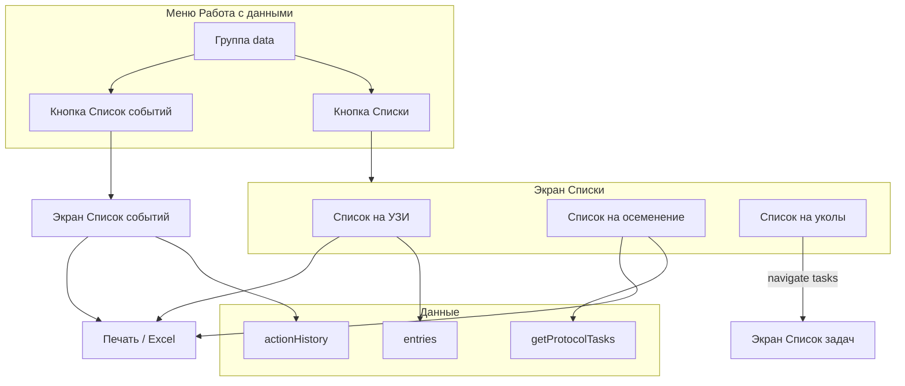

# План: Списки (УЗИ, осеменение, уколы) и список событий

## Текущее состояние

- **Меню «Работа с данными»**: [js/core/menu.js](js/core/menu.js) — группа `data`, кнопки без «Списки».
- **Список задач (уколы)**: уже реализован в [js/features/notifications.js](js/features/notifications.js) — `getProtocolTasks(fromDate, toDate)`, экран `#tasks-screen`, рендер через `renderTasksScreen()` → `renderTasksList()`. Шаги протокола: `step.drug` — «Название инъекции»; для осеменения по протоколу используется то же API с фильтром по `drug === 'Осеменение'`.
- **Данные**: записи в `entries`, поля `status`, `inseminationDate`, `inseminationHistory`, `uziHistory`, `protocol`, `actionHistory`; статусы: Осемененная/Осеменена, Стельная, Холостая и др. ([js/view-list-fields.js](js/view-list-fields.js) — `STATUS_OPTIONS`). Телки = лактация 0 ([js/features/analytics.js](js/features/analytics.js)).
- **История действий**: только в карточке — [js/storage/storage-entries.js](js/storage/storage-entries.js) `pushActionHistory(entry, action, details)` пишет в `entry.actionHistory`. Сейчас вызывается только из УЗИ ([js/ui/cow-operations.js](js/ui/cow-operations.js)); осеменение и постановка на протокол историю не пишут.

---

## 1. Меню и экран «Списки»

- В [js/core/menu.js](js/core/menu.js) в группе `data` добавить кнопку: `{ icon: '📋', text: 'Списки', onclick: "navigate('lists')" }`.
- В [index.html](index.html) добавить экран `#lists-screen`:
  - Заголовок «Списки».
  - Три кнопки: «Список на УЗИ», «Список на осеменение», «Список на уколы».
  - Кнопка «Назад» → `navigate('submenu')` (возврат в «Работа с данными»).
- При открытии `lists` в `navigate()` вызывать инициализацию экрана списков (при необходимости — пустая или подготовка контейнеров для подэкранов).

---

## 2. Список на УЗИ

**Логика отбора (на дату или период «неделя вперёд»):**

- **УЗИ1**: статус содержит «Осеменен» (учесть «Осеменена»/«Осемененная»), дней от последнего осеменения ≥ 32. В примечании списка — «УЗИ1».
- **УЗИ2**: статус «Стельная», дни стельности > 60, в `uziHistory` ровно одна запись (одна проверка). В примечании — «УЗИ2».

**Поля строки:** Номер животного, группа, Дата осеменения, Дни от осеменения, Попытка, Примечание (УЗИ1/УЗИ2).

**Реализация:**

- Новый модуль (например [js/features/lists.js](js/features/lists.js)) или расширение [js/features/notifications.js](js/features/notifications.js):
  - Функция `getUziList(fromDate, toDate, filterCowHeifer)`:
    - По всем `entries` (с учётом `getVisibleEntries` при необходимости) вычислить для каждой даты в диапазоне или на конечную дату: последнее осеменение, дни от осеменения (по `inseminationHistory`/`inseminationDate`), `getDaysPregnant(entry)` из [js/features/view-cow.js](js/features/view-cow.js).
    - УЗИ1: статус осемененная + дни от осеменения ≥ 32 в выбранном диапазоне (в т.ч. «готовить на неделю вперёд» = от сегодня до сегодня+7).
    - УЗИ2: статус стельная, `getDaysPregnant(entry) > 60`, `(entry.uziHistory || []).length === 1`.
  - Фильтр «Коровы / Телки»: Коровы — `lactation !== 0 && lactation !== ''` (и не `null`/`undefined`), Телки — `lactation === 0 || lactation === ''`.
- На экране списков при выборе «Список на УЗИ» показывать подэкран: выбор периода (например «На неделю вперёд» или даты «с»/«по»), переключатель Коровы/Телки/Все, таблица, кнопки «Печать» и «Экспорт в Excel».

---

## 3. Список на осеменение

**Источник:** животные, у которых в протоколе синхронизации в шаге есть «Название инъекции» = «Осеменение» на определённую дату (дата = начало протокола + день шага).

**Поля строки:** Номер животного, группа, Попытка, Протокол синхронизации, Бык, День лактации. День лактации = дни от отёла до даты осеменения по протоколу (по `entry.calvingDate`; при отсутствии отёла — «—» или пусто).

**Реализация:**

- Использовать логику `getProtocolTasks(fromDate, toDate)` в [js/features/notifications.js](js/features/notifications.js), но фильтровать только шаги, у которых `(step.drug || '').trim() === 'Осеменение'` (или нормализовать регистр/пробелы по необходимости).
- Новая функция `getInseminationProtocolList(fromDate, toDate, filterCowHeifer, filterGroups)` — возвращает массив с полями: cattleId, group, attemptNumber (текущая попытка из карточки или следующая), protocolName, bull (из карточки), daysInMilk (дни от calvingDate до даты осеменения по протоколу), date.
- Подэкран «Список на осеменение»: период (планирование заранее), фильтр Коровы/Телки, по группам (множественный выбор или один выбор группы из списка групп), таблица, «Печать», «Экспорт в Excel».

---

## 4. Список на уколы

- В экране «Списки» кнопка «Список на уколы» ведёт на уже существующий экран списка задач: `navigate('tasks')` (как в группе «Уведомления и планы» → «Планы»). Дублировать логику не нужно.
- На экране «Список задач» (`#tasks-screen`) добавить кнопки «Печать» и «Экспорт в Excel» для текущего отображаемого списка задач (см. п. 6).

---

## 5. Печать и экспорт в Excel для списков

- **Печать:** для каждого подэкрана (УЗИ, осеменение, задачи) — кнопка «Печать», по нажатию `window.print()` или рендер скрытого блока с таблицей в печатном виде и вызов печати. Учесть существующие стили печати в [css/style.css](css/style.css) при наличии.
- **Экспорт в Excel:** переиспользовать подход из [js/features/export-excel.js](js/features/export-excel.js) (XLSX): сформировать массив строк по текущему отфильтрованному списку (УЗИ, осеменение, задачи) и один лист с заголовками и данными, скачать файл. Не обязательно открывать диалог выбора полей — достаточно фиксированного набора колонок под каждый тип списка.

---

## 6. Общий список событий и расширение истории

**Требование:** все действия по карточке попадают и в карточку, и в общий список событий. В списке событий — структурированные типы: УЗИ1, УЗИ2, Осеменение, Постановка на протокол и т.д., с дополнительными полями в зависимости от типа.

**Подход:** хранить события только в `entry.actionHistory`; «общий список событий» — это агрегация по всем карточкам. Формат записи истории расширить опциональными полями: `eventType`, `result`, `attemptNumber`, `bull`, `inseminator`, `code`, `protocolName` (для обратной совместимости старые записи остаются с `action` + `details`).

**Изменения:**

- [js/storage/storage-entries.js](js/storage/storage-entries.js): расширить сигнатуру `pushActionHistory(entry, action, details, options)`, где `options` — объект `{ eventType, result, attemptNumber, bull, inseminator, code, protocolName }`. При записи добавлять в элемент `actionHistory` эти поля.
- **УЗИ** ([js/ui/cow-operations.js](js/ui/cow-operations.js)): при сохранении определять тип УЗИ1/УЗИ2 (по текущему статусу до сохранения: осемененная → УЗИ1; стельная и уже одна запись в uziHistory и дни стельности > 60 → УЗИ2) и вызывать `pushActionHistory(entry, 'УЗИ', detailsStr, { eventType: 'УЗИ1'|'УЗИ2', result: result })`.
- **Осеменение** ([js/features/insemination.js](js/features/insemination.js)): после добавления в `inseminationHistory` вызывать `pushActionHistory(entry, 'Осеменение', detailsStr, { eventType: 'Осеменение', attemptNumber, bull, inseminator, code })`. Учесть путь с API ([js/core/app.js](js/core/app.js) или вызовы updateEntryViaApi при наличии).
- **Постановка на протокол** ([js/ui/cow-operations.js](js/ui/cow-operations.js) `saveProtocolAssignEntry()`): после установки `entry.protocol` вызывать `pushActionHistory(entry, 'Постановка на протокол', ... , { eventType: 'Постановка на протокол', protocolName })`.

**Экран «Список событий»:**

- В меню «Работа с данными» добавить кнопку «Список событий» (или разместить её на экране «Списки» рядом с остальными) → переход на экран `#events-screen`.
- В [index.html](index.html) добавить экран `#events-screen`: заголовок «Список событий», контейнер для таблицы, фильтры (по дате, по типу события, по животному/группе — по желанию), кнопки «Печать», «Экспорт в Excel», «Назад».
- Функция `getAllEvents()`: обход `entries`, для каждой записи — `entry.actionHistory`, каждую запись дополнить `cattleId`, `group`, `lactation` из `entry`; сортировка по дате (новые сверху). В таблице колонки: Номер животного, Группа, Лактация, Дата события, Пользователь, Событие (eventType или action). Для типа УЗИ1/УЗИ2 — колонка «Результат» (Стельная/Холостая). Для Осеменение — Попытка, Бык, Осеменатор, Код. Для Постановка на протокол — Название протокола. Старые записи без `eventType` показывать по полю `action` и в колонках доп. полей выводить «—» или парсить `details` при необходимости.

---

## 7. Схема потоков

---

## 8. Порядок внедрения

1. Расширить `pushActionHistory` и добавить вызовы в УЗИ, осеменение, постановку на протокол.
2. Меню: кнопка «Списки» и «Список событий», экраны `#lists-screen` и `#events-screen` в HTML, навигация и инициализация в menu.js.
3. Модуль списков: `getUziList`, `getInseminationProtocolList` (на базе фильтра по step.drug === 'Осеменение'), подэкраны с таблицами и фильтрами Коровы/Телки и периодом.
4. Список событий: `getAllEvents()`, рендер таблицы на `#events-screen` с колонками по типу события.
5. Печать и экспорт в Excel для всех трёх списков (УЗИ, осеменение, события) и для экрана «Список задач».
6. Синхронизация с Electron: дублирование изменений в [electron/](electron/) при сборке (если копирование из корня) или явное обновление [electron/index.html](electron/index.html) и [electron/js/core/menu.js](electron/js/core/menu.js) при необходимости.

---

## Важные файлы

| Компонент                                | Файлы                                                                                                                                                                          |
| ---------------------------------------- | ------------------------------------------------------------------------------------------------------------------------------------------------------------------------------ |
| Меню, навигация                          | [js/core/menu.js](js/core/menu.js), [index.html](index.html)                                                                                                                   |
| Списки (УЗИ, осеменение), список событий | Новый [js/features/lists.js](js/features/lists.js) или разнести по lists.js + events в отдельном модуле                                                                        |
| Задачи (уколы)                           | [js/features/notifications.js](js/features/notifications.js) — getProtocolTasks, renderTasksScreen                                                                             |
| История действий                         | [js/storage/storage-entries.js](js/storage/storage-entries.js), [js/ui/cow-operations.js](js/ui/cow-operations.js), [js/features/insemination.js](js/features/insemination.js) |
| Экспорт                                  | [js/features/export-excel.js](js/features/export-excel.js)                                                                                                                     |
| Данные по животному                      | [js/features/view-cow.js](js/features/view-cow.js) — getDaysPregnant, getInseminationListForEntry; протоколы — getProtocols, step.drug                                         |

Данные из списков и событий в дальнейшем можно использовать для отчётов и аналитики без изменения структуры хранения.