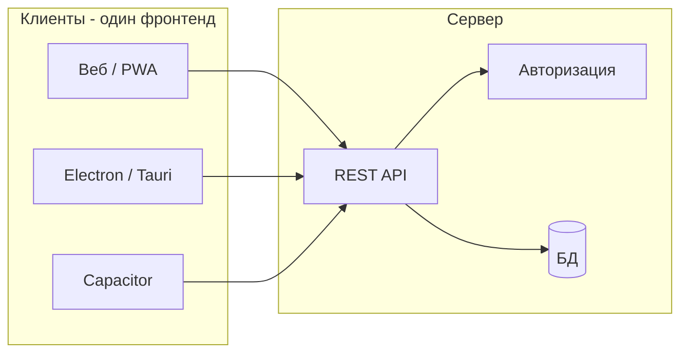

# План: мультиплатформенное исполнение и многопользовательский режим

## Текущее состояние

- **Данные:** [js/storage.js](js/storage.js) — записи в `localStorage` по ключу `cattleEntries_<objectId>`, объекты (базы) в `cattleTracker_objects`, текущий объект в `cattleTracker_currentObject`. Модель записи: `getDefaultCowEntry()` (cattleId, nickname, group, даты, осеменение, статус, protocol, userId, lastModifiedBy, inseminationHistory и др.).
- **Пользователи:** [js/users.js](js/users.js) — пользователи и сессия в `localStorage`, роли `admin` / `operator` / `viewer`, `getVisibleEntries()` (админ видит всё, остальные — по `userId`), права canAdd/canEdit/canDelete.
- **Координация:** [js/core.js](js/core.js) — `CattleTracker` вызывает `loadLocally`/`saveLocally` из storage.js.

Цель — сохранить этот фронтенд, вынести данные и авторизацию на сервер, затем при необходимости упаковать тот же фронт в десктоп и мобильные оболочки.

---

## Архитектура после внедрения

- Один код фронтенда (HTML/CSS/JS) подключается к одному бэкенду по HTTPS.
- Мультиплатформа: тот же фронт показывается в браузере, в Electron/Tauri (десктоп), в Capacitor (мобильные приложения).

---

## Этап 1. Бэкенд API и многопользовательский режим

**Стек (рекомендуемый):** Node.js (Express или Fastify) + СУБД (PostgreSQL или SQLite для старта). Язык совпадает с фронтом, логику валидации и модели легко переиспользовать.

**База данных:**

- Таблицы: `users` (id, username, password_hash, role, created_at), `objects` (id, name, owner_id или привязка к организации), `entries` (поля из текущей модели коровы + object_id, user_id, last_modified_by, created_at, updated_at). Связь: объект имеет много записей; пользователь имеет доступ к объектам (настройка прав: например все пользователи видят все объекты или по ролям/привязкам).
- Миграции: создать таблицы и при необходимости скрипт миграции из текущего формата (экспорт из localStorage в JSON и импорт в БД).

**Авторизация:**

- Регистрация/вход по логину и паролю; пароли хранить только в виде хеша (bcrypt или аналог), не `simpleHash` как в [js/users.js](js/users.js).
- После входа выдавать JWT (или сессионный токен в cookie). Все запросы к API кроме логина/регистрации — с заголовком `Authorization` или cookie.
- Роли: admin / operator / viewer — проверять на сервере при каждом запросе (редактирование/удаление только admin/operator; выборка записей для viewer — только чтение).

**Эндпоинты API (минимальный набор):**

- `POST /api/auth/register`, `POST /api/auth/login`, `POST /api/auth/logout` (инвалидация токена при необходимости).
- `GET /api/objects` — список объектов (баз) для текущего пользователя; `POST /api/objects` — создание объекта.
- `GET /api/objects/:id/entries` — список записей по объекту (с учётом прав: для не-админа фильтр по userId, если решите сохранить модель «свои записи»).
- `GET /api/objects/:id/entries/:cattleId` — одна запись по номеру коровы.
- `POST /api/objects/:id/entries` — создание записи (тело — объект в формате getDefaultCowEntry, доп. поля object_id, user_id проставляются на сервере).
- `PUT /api/objects/:id/entries/:cattleId` — обновление записи.
- `DELETE /api/objects/:id/entries/:cattleId` — удаление записи.

Формат тела запросов/ответов — JSON, структура полей записи совпадает с текущей моделью в [js/storage.js](js/storage.js) (getDefaultCowEntry), чтобы фронт минимально менялся.

Опционально на первом этапе: эндпоинты для резервных копий (например загрузка/скачивание снимка в JSON), уведомления и т.д. — можно добавить позже.

---

## Этап 2. Адаптер хранилища на фронтенде

**Идея:** ввести слой «хранилища», который реализует те же операции, что сейчас делают storage.js и users.js, но обращаются к API вместо localStorage.

- **Новый модуль** (например `js/api-client.js`): функции `loadEntries()`, `saveEntries()` / по-одному `createEntry()`, `updateEntry()`, `deleteEntry()`, `getObjectsList()`, `getCurrentObjectId()`, `setCurrentObjectId()`, `addObject()`, `switchToObject()`; для пользователей — `login()`, `logout()`, `register()`, `getCurrentUser()`, `getVisibleEntries(list)` (при необходимости список приходит с сервера уже отфильтрованным, либо фильтрация на клиенте по тому же правилу).
- Конфигурация: базовый URL API и способ передачи токена (заголовок или cookie). Режим работы: «онлайн» (всегда API) или позже «офлайн с очередью» (кэш + синхронизация при появлении сети).

**Изменения в существующих файлах:**

- [js/storage.js](js/storage.js): заменить реализацию `loadLocally`/`saveLocally` на вызовы api-client (или вынести в отдельный файл `storage-local.js` и подключать либо его, либо api-client в зависимости от конфигурации/окружения). Глобальный массив `entries` по-прежнему заполняется при загрузке и обновляется при сохранении, чтобы [js/core.js](js/core.js), [js/menu.js](js/menu.js), [js/cow-operations.js](js/cow-operations.js) и остальные модули продолжали работать с тем же контрактом.
- [js/users.js](js/users.js): заменить вызовы к localStorage на вызовы api-client для login/register/logout и получения текущего пользователя; при первом заходе на страницу проверять токен (если есть — запрос за текущим пользователем) и обновлять UI (auth bar).

Важно: сохранить совместимость с текущими вызовами (`loadLocally()`, `saveLocally()`, `getVisibleEntries(entries)`, `getCurrentUser()` и т.д.), чтобы не переписывать формы и меню. Точки входа — только слой storage/users.

Опционально: на этапе разработки оставить возможность переключаться «только localStorage» / «только API» (например по флагу или по наличию переменной с URL API), чтобы можно было тестировать без сервера.

---

## Этап 3. Мультиплатформенное исполнение (оболочки)

Один и тот же фронтенд (после этапа 2 уже работающий по API) раздаётся или упаковывается тремя способами:

| Платформа | Способ                                                                                                                         | Результат                                 |
| --------- | ------------------------------------------------------------------------------------------------------------------------------ | ----------------------------------------- |
| Веб       | Размещение статики (index.html + css + js) на том же сервере или CDN; PWA (manifest + Service Worker) как сейчас               | Сайт + «Установить приложение» в браузере |
| Десктоп   | Electron или Tauri: загрузка в окне того же index.html с URL на ваш фронт (или локальная копия), общение с тем же API по HTTPS | Исполняемый файл для Windows/macOS/Linux  |
| Мобильные | Capacitor: проект с WebView, загружающий тот же фронт (по URL или собранный в приложение), те же запросы к API                 | Приложение в магазинах                    |

Общие моменты:

- В конфигурации фронта задаётся один базовый URL API (для всех платформ один и тот же бэкенд).
- CORS на сервере настроить так, чтобы запросы с веб-домена и с оболочек (file:// или кастомные схемы при необходимости) допускались, либо фронт открывается с того же домена, что и API.
- В Electron/Tauri при необходимости можно добавить настройки (прокси, сохранение токена в безопасном хранилище ОС) без изменения основной логики приложения.

Порядок внедрения: сначала стабильный веб + API (этапы 1–2), затем при необходимости добавить сборку Electron и/или Capacitor (этап 3).

---

## Порядок работ и риски

1. **Сначала этап 1:** реализовать бэкенд, миграции схемы, авторизацию и CRUD по объектам и записям; проверить через Postman/curl.
2. **Затем этап 2:** api-client и переключение storage/users на API; проверить текущий сценарий (вход, объекты, список, добавление/редактирование/удаление записей) в браузере.
3. **При необходимости этап 3:** создать проект Electron (или Tauri) и Capacitor, подставить тот же фронт и URL API; настроить сборку и подписание для магазинов приложений.

Риски: смена формата данных при миграции (нужно сохранить совместимость полей и при необходимости скрипт импорта из текущего localStorage); офлайн-режим (сейчас не в плане — при желании добавляется отдельно как кэш + очередь изменений поверх текущего API).

---

## Итог

- **Многопользовательский режим** обеспечивается бэкендом: единая БД, авторизация и роли на сервере; фронт только вызывает API и отображает данные.
- **Мультиплатформенное исполнение** достигается одним фронтендом (текущий JS/HTML/CSS) в трёх вариантах доставки: веб (PWA), десктоп (Electron/Tauri), мобильные (Capacitor), без дублирования бизнес-логики.

