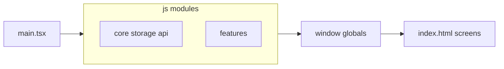

# Оптимизация кода и разделение для удобства работы

## Текущая архитектура (кратко)

- **Точка входа:** [js/main.tsx](js/main.tsx) импортирует модули **в фиксированном порядке**; каждый модуль вешает API на `window` (паттерн «side-effect + `export {}`»).
- **React:** [js/App.tsx](js/App.tsx) пока пустой контейнер; экраны в основном в [index.html](index.html) и управляются через `window.navigate` и глобальные `init*`.
- **Electron:** [electron/copy-web.js](electron/copy-web.js) копирует `js/`, `css/`, бандл в `electron/` — **канонический код клиента — папка `js/`** (не править дубликаты в `electron/js/` вручную).

## Где больше всего выигрыша от разделения

По объёму (приблизительно по строкам) явные кандидаты:

| Файл                                                                                                                                                                        | Зачем дробить                                                                                                                                                                                                                                                                                                                                                                  |
| --------------------------------------------------------------------------------------------------------------------------------------------------------------------------- | ------------------------------------------------------------------------------------------------------------------------------------------------------------------------------------------------------------------------------------------------------------------------------------------------------------------------------------------------------------------------------ |
| [js/features/action-batch.js](js/features/action-batch.js) (~1400+ строк)                                                                                                   | Один IIFE на все экраны «Действий»: общий каркас (оверлей, черновик, `runSequentialUpdates`, автодополнение) + отдельные блоки по сценариям (осеменение, сухостой, УЗИ, протокол, отёл, аборт). Логично: `action-batch-core.js` + `action-batch-insemination.js` и т.д., с регистрацией `window.initActionBatch*` из маленьких файлов или одного тонкого `action-batch/index`. |
| [js/features/sync.js](js/features/sync.js) (~800 строк)                                                                                                                     | Смешение UI настроек, health, импорт/экспорт через API, индикаторы — можно разнести на `sync-api.js`, `sync-ui.js`, `sync-health.js` (имена условные), сохранив один публичный слой на `window`, чтобы не трогать HTML.                                                                                                                                                        |
| [js/ui/cow-operations.js](js/ui/cow-operations.js) (~1000 строк)                                                                                                            | Операции над одной коровой / формами — часто делят по доменам (редактирование, валидация, специфичные действия).                                                                                                                                                                                                                                                               |
| [js/core/menu.js](js/features/lists.js](js/features/lists.js) / [js/features/analytics.js](js/features/analytics.js) / [js/features/view-list.js](js/features/view-list.js) | Крупные UI/списки/отчёты — вынос чистых функций (сортировка, фильтрация, расчёты) в `*.calc.js` или `*-helpers.js` уже частично сделано для аналитики; можно продолжить тот же стиль.                                                                                                                                                                                          |

**Сервер:** [server/server.js](server/server.js) тонкий; логика в [server/routes/](server/routes/) и [server/db.js](server/db.js) — дробить дальше имеет смысл только если отдельные роуты разрастутся (вынос хелперов в `server/lib/`).

## Дублирование и «мусорные» пути

- В корне `js/` есть файлы вроде `view-list-fields.js`, `constants.js`, `analytics-calc.js`, `export-import-parse.js` **параллельно** вложенным `js/features/` и `js/utils/`. В [js/main.tsx](js/main.tsx) подключаются **вложенные** пути. Имеет смысл **проверить**, не являются ли корневые копии мёртвыми (и не дублируются ли в [electron/js/](electron/js/) как легаси), и при подтверждении удалить или явно задокументировать одну «истину».

## Оптимизация производительности (осторожно, без перфоманса вслепую)

- **Сборка:** при необходимости — `dynamic import()` для тяжёлых редких экранов (например Excel/чат), чтобы уменьшить начальный бандл; сейчас всё тянется синхронно из `main.tsx`.
- **Рантайм:** после разбиения файлов проще найти узкие места (лишние полные перерисовки списка, частые `querySelector` в цикле). Без профилирования не стоит менять алгоритмы «наугад».

## Риски и как их снизить

1. **Порядок загрузки:** глобалы должны существовать до вызовов из HTML/`menu.js`. После сплита — либо сохранить один «агрегирующий» импорт в `main.tsx` в том же порядке, либо явно документировать новые зависимости между чанками.
2. **Тесты:** есть Vitest и Playwright — после разнесения модулей прогнать `npm test` и релевантные e2e.
3. **Версия:** по правилам проекта после реальных правок кода — bump patch в корневом [package.json](package.json).

## Рекомендуемый порядок работ (если браться за рефакторинг)

1. Зафиксировать baseline: тесты + ручной сценарий «Действия» и «Синхронизация».
2. Первый безопасный шаг: **action-batch** — вынести общие хелперы в отдельный файл, затем по одному экрану в подмодуль, не меняя имён `window.initActionBatch`*.
3. Затем **sync.js** по смысловым блокам.
4. Аудит дубликатов в корне `js/` vs `js/features` / `js/utils`.
5. По желанию — постепенный перевод критичных кусков на именованные `export` и импорты вместо роста `window` (долгий путь, затрагивает много вызовов из HTML).

Итог: **да, возможность есть и она в первую очередь в клиентских «мегамодулях» и в уборке дубликатов путей**; сервер уже в разумном виде. Оптимизация скорости — вторична и опирается на профилирование после упрощения структуры.