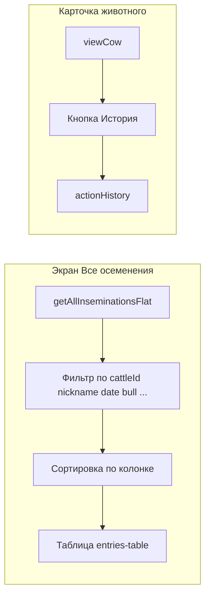

# План: осеменения как список животных + история по карточке

## 1. Текущее состояние

- **«Список всех животных»** ([electron/js/view-list.js](electron/js/view-list.js)): экран `view-screen` с шапкой, кнопкой «Настройка полей», блоком поиска/фильтра ([electron/js/search-filter.js](electron/js/search-filter.js) → `search-filter-container`), таблицей `entries-table` с сортировкой по клику на заголовок и видимыми колонками из `VIEW_LIST_FIELDS` + localStorage.
- **«Все осеменения»** ([electron/js/view-cow.js](electron/js/view-cow.js) — `renderAllInseminationsScreen()`): экран `all-inseminations-screen` с простой шапкой и таблицей `cow-insemination-table all-inseminations-table` без поиска, фильтра и сортировки. Данные — плоский список из `getAllInseminationsFlat()` (одна строка = одно осеменение; на одно животное может быть много строк — **правила уникальности по номеру коровы нет, так и задумано**).
- **Карточка животного** ([electron/js/view-cow.js](electron/js/view-cow.js) — `viewCow()`): кнопки «Редактировать», «Запуск», «Отел», «Поставить на протокол», «Назад». Показывается только `lastModifiedBy`. Полноценной истории действий в коде нет.

---

## 2. Визуальное оформление «Все осеменения» как «Список всех животных»

- В [electron/index.html](electron/index.html): привести разметку `all-inseminations-screen` к той же структуре, что и `view-screen`:
  - Оставить `view-screen-header` с кнопкой «Назад» и заголовком.
  - Добавить контейнер для поиска/фильтра по осеменениям (отдельный от `search-filter-container`, например `all-inseminations-filter-container`).
  - Добавить контейнер для «Настройка полей» и опционально место под массовые действия (если решите не делать массовые действия для осеменений — можно не добавлять).
- В [electron/js/view-cow.js](electron/js/view-cow.js) (или отдельный модуль для экрана осеменений): рендерить таблицу в стиле списка животных — использовать класс `entries-table`, те же отступы и обёртку `view-entries-wrapper`, чтобы визуально экран совпадал с «Список всех животных».

---

## 3. Фильтрация и сортировка в «Все осеменения»

- **Данные**: источник — по-прежнему `getAllInseminationsFlat()` (элементы: `cattleId`, `nickname`, `date`, `attemptNumber`, `bull`, `inseminator`, `code`, `daysFromPrevious`). Одна запись = одно осеменение; фильтр по номеру/кличке позволит увидеть «все осеменения по конкретному животному».
- **Фильтр** (отдельный от search-filter.js, т.к. данные — плоский список осеменений):
  - Поиск по номеру коровы, кличке (и при необходимости по быку, осеменителю, коду).
  - Опционально: период по дате осеменения (от/до), бык, осеменитель. Без полей, не имеющих смысла для осеменений (статус, лактация, синхронизация — при желании можно не включать или сделать скрытыми).
- **Сортировка**: по аналогии с [electron/js/view-list.js](electron/js/view-list.js) — клик по заголовку колонки меняет ключ сортировки и направление (asc/desc). Ключи: `cattleId`, `nickname`, `date`, `attemptNumber`, `bull`, `inseminator`, `daysFromPrevious`, `code`. Для дат и чисел — сравнение по значению, для строк — по алфавиту.
- **Настройка полей**: аналог «Настройка полей» для списка животных — набор колонок только для осеменений (Номер коровы, Кличка, Дата осеменения, Попытка, Бык, Осеменитель, Дней от предыдущего, Код). Сохранять выбранные колонки в localStorage (отдельный ключ, например `cattleTracker_allInseminations_visibleFields`), рисовать таблицу только по выбранным полям.

Исключить из функционала списка осеменений ненужные для этого экрана поля: чекбоксы и массовое удаление можно не делать; фильтры «Статус», «Лактация», «Синхронизация» для плоского списка осеменений не добавлять (или оставить только релевантные: дата, корова/кличка, бык, осеменитель).

---

## 4. История по карточке животного

- **Модель данных**: в каждой записи животного добавить массив `actionHistory` (если его нет — считать пустым). Элемент: `{ dateTime, userName, action [, details ] }`.
  - `dateTime` — ISO или тот же формат, что и `dateAdded` (единообразие с [electron/js/storage-entries.js](electron/js/storage-entries.js)).
  - `userName` — при наличии авторизации: `getCurrentUser().username`, иначе `'Admin'` (как в запросе).
  - `action` — строка: «Добавление», «Редактирование», «Осеменение», «Отёл», «Запуск (сухостой)», «Протокол», «Удаление» и т.п.
  - `details` — опционально краткое описание (например дата осеменения, номер попытки).
- **Где записывать**:
  - Добавление: [electron/js/app.js](electron/js/app.js) — `addEntry()` (после успешного добавления).
  - Редактирование: [electron/js/app.js](electron/js/app.js) — `saveCurrentEntry()` (при обновлении существующей записи).
  - Осеменение: [electron/js/insemination.js](electron/js/insemination.js) — `addInseminationEntry()` (после добавления в `inseminationHistory`).
  - Запуск/отёл/протокол: [electron/js/cow-operations.js](electron/js/cow-operations.js) — в функциях, которые меняют запись (сухостой, отёл, протокол), после успешного сохранения.
  - Удаление: при удалении запись пропадает; при желании можно перед удалением дописывать последнее событие «Удаление» в локальную копию и показывать в UI только до удаления — иначе историю удалённой карточки не показывать.
- **Инициализация**: в [electron/js/storage-entries.js](electron/js/storage-entries.js) в `getDefaultCowEntry()` добавить поле `actionHistory: []`. При загрузке старых данных не ломать записи без `actionHistory` (проверка `entry.actionHistory || []` при отображении).
- **UI в карточке** ([electron/js/view-cow.js](electron/js/view-cow.js)):
  - Рядом с кнопками «Запуск», «Отел» и др. добавить кнопку **«История»**.
  - По нажатию — показывать модальное окно (или раскрывающийся блок под кнопками) со списком событий: дата/время, пользователь, действие, при необходимости details. Сортировка по убыванию даты (последние сверху).
- **Удаление записи из истории**: если пользователь удаляет действие в интерфейсе истории (кнопка «Удалить»/иконка у строки), соответствующая запись удаляется из массива `actionHistory`, данные сохраняются (saveLocally / updateEntryViaApi). После удаления список в модальном окне обновляется — запись пропадает из истории.

---

## 5. Действие «УЗИ»

Специалист вносит данные проверки на стельность в карточку животного.

- **Поля ввода** (экран или модальное окно «УЗИ», по аналогии с осеменением/запуском/отёлом):
  - **Дата проверки на стельность** — дата проведения УЗИ.
  - **Результат** — выбор из двух вариантов: «Не стельная» или «Стельная». После сохранения влияет на статус животного: при «Стельная» — установить статус «Стельная», при «Не стельная» — например «Холостая» (уточнить по существующей логике статусов в приложении).
  - **Специалист** — текст, кто проводил УЗИ.
  - **Дней от осеменения** — поле только для отображения (вычисляемое): интервал в днях между датой **последнего осеменения до данной проверки** и датой проверки. В расчёт входят только осеменения, дата которых строго до даты УЗИ; последующие осеменения не учитываются. Формула: по текущей записи животного взять `inseminationHistory` (и при отсутствии — одно осеменение из полей `inseminationDate` и т.д.), отфильтровать записи с датой &lt; даты УЗИ, взять максимальную дату осеменения, вычислить разницу в днях до даты проверки; если осеменений до УЗИ нет — показывать «—» или пусто.
- **Хранение**: в записи животного добавить массив `uziHistory` (или одно поле с последней проверкой — при необходимости хранить несколько проверок). Элемент: `{ date, result, specialist, daysFromInsemination }`. При сохранении УЗИ добавлять запись в `uziHistory`, в `actionHistory` добавлять событие с действием «УЗИ» и details (дата, результат, специалист, дней от осеменения).
- **Интеграция**: кнопка **«УЗИ»** в карточке животного (рядом с «Запуск», «Отел», «История»). Переход на экран/модалку ввода УЗИ с подставленным номером животного; после сохранения — обновление карточки и списков.

---

## 6. Схема потока данных (кратко)

---

## 7. Что ещё можно учесть (опционально)

- **Обратная совместиость**: при первом открытии карточки/истории для записей без `actionHistory` показывать пустой список или одну строку «Данные добавлены до введения истории» с датой из `dateAdded` и пользователем `lastModifiedBy` или «Admin».
- **Экспорт**: если есть экспорт списка осеменений — применять к нему текущий фильтр и сортировку.
- **Дублирование кода**: общую логику «таблица с сортировкой и настройкой полей» можно вынести в переиспользуемую функцию (как в view-list), принимающую массив полей и массив данных, чтобы не дублировать разметку и обработчики.

---

## 8. Файлы для изменений

| Задача                                                      | Файлы                                                                                                                                                                                                                                  |
| ----------------------------------------------------------- | -------------------------------------------------------------------------------------------------------------------------------------------------------------------------------------------------------------------------------------- |
| Оформление и разметка экрана «Все осеменения»               | [electron/index.html](electron/index.html)                                                                                                                                                                                             |
| Таблица, фильтр, сортировка, настройка полей для осеменений | [electron/js/view-cow.js](electron/js/view-cow.js) или новый `electron/js/all-inseminations-list.js`                                                                                                                                   |
| Стили (при необходимости)                                   | [electron/css/components-tables.css](electron/css/components-tables.css)                                                                                                                                                               |
| Модель и запись истории                                     | [electron/js/storage-entries.js](electron/js/storage-entries.js), [electron/js/app.js](electron/js/app.js), [electron/js/insemination.js](electron/js/insemination.js), [electron/js/cow-operations.js](electron/js/cow-operations.js) |
| Кнопка и модальное окно «История»                           | [electron/js/view-cow.js](electron/js/view-cow.js), [electron/index.html](electron/index.html) (модалка при необходимости)                                                                                                             |

Если нужно, можно сузить или расширить список полей фильтра/колонок под ваши сценарии использования.