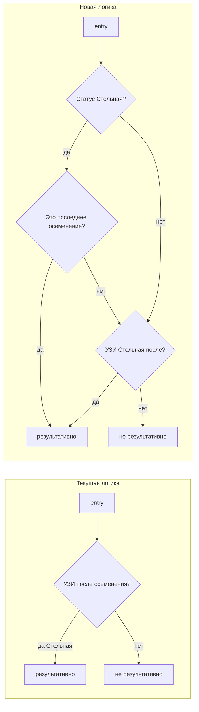

# Стельная = последнее осеменение результативно + годовой анализ по всем лактациям

## Текущее поведение

- **Результативность осеменения** (блок «Воспроизведение» в Аналитике) считается только по УЗИ: осеменение считается результативным, если есть запись УЗИ «Стельная» *после* этой даты ([inseminationResultedInPregnancy](js/features/analytics.js) в [js/features/analytics.js](js/features/analytics.js)). Если статус коровы уже выставлен в «Стельная», но УЗИ после последнего осеменения не заведено, это осеменение в проценте не учитывается.
- **Список для отчёта** (PR/CR/HDR и карточки) формируется в [getFilteredEntries](js/features/analytics-calc.js) в [js/features/analytics-calc.js](js/features/analytics-calc.js): отбираются только животные с **лактацией ≥ 1** (`hasLactationOnePlus`) и с датой отёла; тёлки (лактация 0) и животные без отёла в выборку не попадают, поэтому годовой анализ по «всем лактациям» их не включает.

## Предлагаемые изменения

### 1. Статус «Стельная» ⇒ последнее осеменение результативно

**Файл:** [js/features/analytics.js](js/features/analytics.js) (при сборке копируется в electron через `copy-web.js`, отдельно правки в electron не нужны).

В функции **inseminationResultedInPregnancy(entry, insemDateStr)**:

- Добавить в начало (или сразу после парсинга даты): если у коровы статус содержит «Стельная», вычислить дату **последнего** осеменения по этой корове (из `inseminationHistory` или `inseminationDate`), привести к одному формату и сравнить с `insemDateStr`. Если это осеменение и есть последнее по времени — считать его результативным и возвращать `true`.
- Иначе оставить текущую логику по УЗИ (есть УЗИ «Стельная» после данной даты осеменения).

Так стельные по статусу будут корректно учитываться в блоке «Воспроизведение» (в т.ч. «Стельных из них») без обязательной записи УЗИ после последнего осеменения.

**Детали реализации:** использовать ту же логику сбора дат осеменения, что и в [getReproductionData](js/features/analytics.js): `inseminationHistory` или один элемент с `inseminationDate`. Отсортировать даты, взять последнюю; нормализовать сравнение дат (например, через `parseDateRepr` и сравнение по времени или по строке YYYY-MM-DD), чтобы совпадение «это осеменение = последнее» было однозначным.

### 2. Годовой анализ по всем лактациям

**Файл:** [js/features/analytics-calc.js](js/features/analytics-calc.js).

В функции **getFilteredEntries(period, dateFrom, dateTo, pdo)**:

- Для периода **year** (или для произвольного периода с датами на целый год — уточнить, что считаем «годовым»: только `period === 'year'` из селектора) расширить выборку:
  - Не отбрасывать животных с лактацией 0 или без отёла: если у записи нет `calvingDate` (или лактация 0), включать её в список для года, если есть активность в периоде — например, дата осеменения или `dateAdded` попадает в `[bounds.start, bounds.end]`, и запись не «Брак».
  - Для таких записей проверку ПДО (pdoEnd) не применять (нет отёла).
- Для периодов month/quarter оставить текущую логику (только лактация ≥ 1 и с отёлом), чтобы не менять месячные/квартальные отчёты без необходимости.

В результате при выборе «Год» в аналитике в расчёт войдут и тёлки (лактация 0), и все лактации, что даст полноценный годовой анализ по стаду.

### 3. Сводка мест изменений

| Задача                                      | Файл                                                           | Что менять                                                                                                                                    |
| ------------------------------------------- | -------------------------------------------------------------- | --------------------------------------------------------------------------------------------------------------------------------------------- |
| Последнее осеменение при статусе «Стельная» | [js/features/analytics.js](js/features/analytics.js)           | `inseminationResultedInPregnancy`: добавить ветку «статус Стельная и дата = последнее осеменение»                                             |
| Годовой анализ по всем лактациям            | [js/features/analytics-calc.js](js/features/analytics-calc.js) | `getFilteredEntries`: при `period === 'year'` не отбрасывать записи без отёла/лактация 0, включать по дате осеменения или dateAdded в периоде |

После правок имеет смысл пройти сценарии: выбор периода «Год» и проверка, что в отчёте есть осеменения по тёлкам и что коровы со статусом «Стельная» без УЗИ после последнего осеменения дают это осеменение в «Стельных из них» в блоке Воспроизведение.