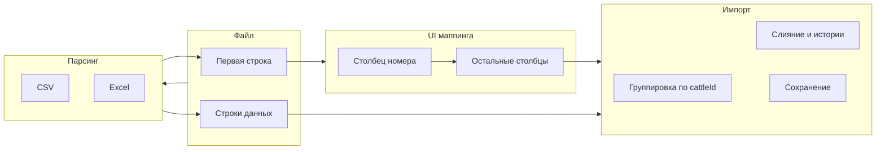

# Улучшение импорта: маппинг столбцов и несколько строк на животное

## Текущее состояние

- **Импорт CSV** ([js/export-import.js](js/export-import.js)): первая строка участвует только в определении разделителя; данные разбираются по **фиксированным индексам** (0 = номер, 1 = кличка, 2 = группа/дата рождения, …). Одна строка файла = одна запись или обновление по `cattleId`.
- **Импорт Excel** ([js/export-import.js](js/export-import.js), `importFromExcelWide`): жёстко заданные колонки (0–19), до 7 осеменений в одной строке, история осеменений собирается в `inseminationHistory`; проверки на стельность (УЗИ) при импорте **не заносятся**.
- Структура записи: `entries[]` с полями из [js/storage-entries.js](js/storage-entries.js) (`getDefaultCowEntry`), включая `inseminationHistory[]`, `uziHistory[]`, `actionHistory[]`. Формат УЗИ в [js/cow-operations.js](js/cow-operations.js): `{ date, result: 'Стельная'|'Не стельная', specialist?, daysFromInsemination? }`.
- Названия полей для отображения заданы в [js/field-config.js](js/field-config.js) (`COW_FIELDS`) и в [js/export-excel.js](js/export-excel.js) (`CSV_HEADERS`).

## Целевой сценарий

1. Пользователь выбирает файл (CSV или XLSX).
2. Читается **первая строка** — заголовки столбцов файла.
3. Открывается диалог маппинга:
  - **Шаг 1 (обязательный):** выбор столбца файла, в котором хранится **номер животного**. Без выбора импорт запускать нельзя.
  - **Шаг 2:** для каждого остального столбца файла — сопоставление с полем программы (или «Не импортировать»). Отображать можно «кучей» (все столбцы на одном экране) или поочерёдно (по одному) — в плане заложен один экран со всеми выборами; при желании позже добавить пошаговый вариант.
4. Импортируются **только выбранные** столбцы; незамапленные не используются.
5. В файле может быть **несколько строк на одно животное**:
  - Все даты осеменения из строк по одному `cattleId` собираются в **список осеменений** (`inseminationHistory`), с сортировкой по дате.
  - Если есть столбец с результатом проверки на стельность — добавлять запись в **историю проверок** (`uziHistory`) с результатом. **Дата проверки:** из столбца, если есть; иначе — дата **следующего** осеменения по этому животному; если следующего нет — **дата последнего осеменения + 32 дня**.

## Архитектура решения

## План реализации

### 1. Единый парсинг файла (заголовки + строки)

- **CSV:** после определения разделителя парсить с `header: false`, первая строка → массив названий столбцов, остальные → строки. Уже есть логика в `importFromCSV` и `processImportData`; вынести в общую функцию вида `parseFileToHeadersAndRows(file)` → `Promise<{ headers: string[], rows: string[][] }>` (для CSV — после `decodeCsvFileContent` и Papa.parse).
- **Excel:** первая строка листа → `headers`, со второй — `rows`. Привести к тому же формату `{ headers, rows }`. Для ячеек использовать уже существующие `normalizeDateForStorage` и очистку строк.
- Вызов: при выборе файла вызывать `parseFileToHeadersAndRows`, при успехе не вызывать сразу `processImportData`, а открывать диалог маппинга.

### 2. Диалог маппинга столбцов

- **Разметка:** новый модальный блок в [index.html](index.html) (и при необходимости в [electron/index.html](electron/index.html)), по аналогии с `exportSettingsModal` и `viewFieldsSettingsModal`: контейнер с `id`, например `importMappingModal`, overlay, кнопки «Назад», «Импортировать», «Отмена».
- **Шаг 1 — номер животного:** заголовок «Выберите столбец с номером животного»; один `<select>` с вариантами — названия столбцов из файла (значение — индекс или имя столбца). Без выбора кнопка «Импортировать» неактивна или выводится предупреждение.
- **Шаг 2 — остальные столбцы:** для каждого столбца файла (кроме выбранного как номер животного) — строка: «Название столбца в файле: X» и выпадающий список «Сопоставить с полем»:
  - вариант «Не импортировать» (значение пустое или `_skip`);
  - поля из `COW_FIELDS` (ключ + label): Кличка, Группа, Дата рождения, Лактация, Дата отёла, Дата осеменения, Номер попытки, Бык, Осеменитель, Код, Статус, Протокол, Начало протокола, Дата выбытия, Начало сухостоя, Примечание и т.д.;
  - отдельно два «специальных» поля для импорта: **«Дата осеменения»** (попадает в `inseminationHistory`), **«Результат проверки на стельность»** (Стельная/Не стельная → `uziHistory`), **«Дата проверки на стельность»** (дата УЗИ).
- Данные для шага 2 можно показывать одним блоком (все столбцы списком) — «кучей»; при желании позже добавить пошаговый режим.
- Состояние диалога: в замыкании или в `data-*` хранить `{ headers, rows }` и выбранный файл/тип (csv/xlsx), чтобы по нажатию «Импортировать» вызвать новую функцию импорта с маппингом.

### 3. Модель маппинга и список полей для импорта

- Маппинг: объект вида `{ fileColumnIndex: programFieldKey }` или `{ [headerName]: programFieldKey }`. Обязательно одно поле: `cattleId` (ключ программы) = выбранный столбец.
- Список полей для выпадающего списка: взять из `window.COW_FIELDS` (key + label), плюс отдельные ключи для импорта:
  - `inseminationDate` — «Дата осеменения» (при импорте добавляется в `inseminationHistory`);
  - `pregnancyCheckResult` — «Результат проверки на стельность»;
  - `pregnancyCheckDate` — «Дата проверки на стельность».
- Нормализация результата проверки: значения вроде «стельная», «не стел», «яловая» и т.п. приводить к «Стельная» / «Не стельная» (частично уже есть `normalizeStatusFromImport`; при необходимости вынести отдельную функцию для УЗИ).

### 4. Логика импорта с маппингом и несколькими строками на животное

- **Вход:** `rows` (массив строк/массивов ячеек), `columnMapping` (индекс столбца файла → ключ поля), `headers`.
- **Извлечение по строке:** для каждой строки строить объект вида `{ cattleId, nickname?, inseminationDate?, attemptNumber?, bull?, ... pregnancyCheckResult?, pregnancyCheckDate? }` по маппингу (брать только замапленные столбцы). `cattleId` очищать (trim, нормализация); пустой `cattleId` → строку пропускать.
- **Группировка:** сгруппировать строки по `cattleId` (одно и то же животное — несколько строк).
- **Для каждого `cattleId`:**
  - **Профиль коровы** (однозначные поля): кличка, группа, дата рождения, лактация, дата отёла, статус, протокол, даты выбытия/сухостоя, примечание и т.д. Стратегия: из всех строк по этому животному брать «первое непустое» или «последнее непустое» (достаточно «последнее непустое» по порядку строк).
  - **История осеменений:** из каждой строки группы, где есть дата осеменения, формировать элемент `{ date, attemptNumber, bull, inseminator, code }`; собрать в массив, отсортировать по `date`, записать в `entry.inseminationHistory` (объединить с существующей, если запись уже была, и снова отсортировать). Последнее осеменение синхронизировать с полями `inseminationDate`, `attemptNumber`, `bull`, `inseminator`, `code` (как в текущем коде).
  - **Проверки на стельность:** из каждой строки группы, где есть `pregnancyCheckResult`, добавлять одну запись в `entry.uziHistory`. **Дата проверки:**  
    1. если в строке есть `pregnancyCheckDate` и она валидна — использовать её;  
    2. иначе если у этого животного есть осеменение с датой **позже** текущей строки (по порядку строк/дат) — взять дату следующего осеменения как дату проверки;  
    3. иначе — дата последнего осеменения по этому животному + 32 дня.  
    Результат нормализовать до «Стельная» / «Не стельная»; при необходимости вычислять `daysFromInsemination` по `getLastInseminationDateBefore` (или аналог по уже построенной истории).
- **Создание/обновление:** если записи с таким `cattleId` нет — создать через `getDefaultCowEntry()`, заполнить профиль и истории; если есть — обновить профиль и дописать в `inseminationHistory` и `uziHistory` (без дубликатов по дате/результату при необходимости). В конце — `saveLocally()`, `updateList()`, `updateViewList()`, сообщение о количестве добавленных/обновлённых.

### 5. Интеграция в текущий поток

- **handleImportFile:** после чтения файла вызывать `parseFileToHeadersAndRows` (общий парсер для CSV/Excel), при успехе — открывать модальное окно маппинга и передавать в него `{ headers, rows, fileType }`. Старую прямую цепочку «файл → processImportData» заменить на «файл → маппинг → новый импорт с маппингом».
- **Обратная совместимость:** при необходимости можно оставить кнопку «Импорт без маппинга (по шаблону)», вызывающую текущий `processImportData` для CSV с фиксированным порядком колонок; в рамках этой задачи можно не делать, если решите полностью перейти на маппинг.

### 6. Файлы для изменений

| Файл                                                                                    | Изменения                                                                                                                                                                                                                                                                                                                 |
| --------------------------------------------------------------------------------------- | ------------------------------------------------------------------------------------------------------------------------------------------------------------------------------------------------------------------------------------------------------------------------------------------------------------------------- |
| [js/export-import.js](js/export-import.js)                                              | Парсеры в `parseFileToHeadersAndRows` (CSV + Excel); открытие диалога маппинга; новая функция `runImportWithMapping(rows, mapping, options)` с группировкой по `cattleId`, формированием `inseminationHistory` и `uziHistory` и правилом даты проверки; нормализация результата УЗИ; вызов из диалога по «Импортировать». |
| [js/field-config.js](js/field-config.js) или [js/export-import.js](js/export-import.js) | Список полей для маппинга (включая `pregnancyCheckResult`, `pregnancyCheckDate`, `inseminationDate` для истории).                                                                                                                                                                                                         |
| [index.html](index.html)                                                                | Разметка модального окна `importMappingModal`: шаг 1 (выбор столбца номера), шаг 2 (таблица/список «столбец файла → поле программы»), кнопки.                                                                                                                                                                             |
| [electron/index.html](electron/index.html)                                              | То же, если разметка дублируется.                                                                                                                                                                                                                                                                                         |
| [css/](css/) (при необходимости)                                                        | Стили для модального окна маппинга (по аналогии с экспортом).                                                                                                                                                                                                                                                             |

### 7. Важные детали

- **Кодировка CSV:** оставить текущую логику `decodeCsvFileContent` (UTF-8 BOM / Windows-1251).
- **Нормализация дат:** использовать существующие `normalizeDateForStorage` и парсинг дат из Excel (XLSX.SSF), как в текущем коде.
- **Добавление 32 дней к дате:** учесть смену месяца/года; использовать `new Date(lastInsem)` + 32 дня и формат YYYY-MM-DD.
- **Дубликаты в историях:** при слиянии с существующей записью объединять `inseminationHistory` и `uziHistory` без дубликатов по дате (и при необходимости по результату для УЗИ).

## Итог

После реализации: пользователь выбирает файл → видит заголовки → обязательно выбирает столбец с номером животного → сопоставляет остальные столбцы с полями (или пропускает) → импортирует только выбранные данные; несколько строк по одному животному объединяются в одну запись с заполненной историей осеменений и проверок на стельность с корректной датой проверки.