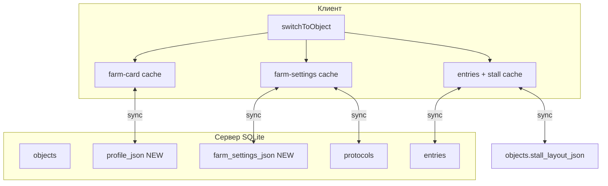

# Хранение и переключение баз по хозяйствам

## Текущее состояние (кратко)

В приложении **«хозяйство» = «объект/база»** (`objectId`: `default`, `obj_*`). Переключение: [`js/storage/storage-objects.js`](js/storage/storage-objects.js) → `switchToObject` → `loadLocally()` — подгружаются только **записи коров** для `cattleEntries_{objectId}`.

| Слой по вашей модели | Сейчас | Проблема |
|----------------------|--------|----------|
| Карточка хозяйства | Только `id` + `name` в списке объектов | Контактов, адресов, специалистов нет |
| Настройки | Протоколы — на сервере per-object; offline — **один** ключ `cattleTracker_protocols`; техники/быки/препараты — **глобально** [`js/features/farm-settings.js`](js/features/farm-settings.js) | При смене базы списки ИО не меняются |
| Стадо | `entries` per-object; стойломеста — `cattleTracker_stallLayout_{id}`; осеменения/события — внутри записей | Backup: только entries + stall, без protocols и настроек |

Сервер уже близок к «полному снимку»: [`GET /api/objects/:id/export`](server/routes/objects.js) → `{ object, entries, protocols, stall_layout }`, но без карточки и farm-settings, и не в виде архива из файлов.



---

## Целевая модель (3 слоя)

### 1. `farm-card.json` — карточка хозяйства (новое)

Расширенная схема (версия в `manifest.json`):

- `name`, `legalName` (опционально), `notes`
- `addresses[]`: `{ label, line1, line2, city, region, zip }`
- `contacts[]`: `{ name, role, phone, email, notes }`
- `specialists[]`: `{ name, role, phone, email }` — отдельно от «контактов», если нужны внутренние роли (ветврач, зоотехник и т.д.)

**Сервер:** колонка `objects.profile_json` (TEXT) + `GET/PUT /api/objects/:id/profile`.

**Клиент:** `localStorage` ключ `cattleTracker_farmProfile_{objectId}`; UI — новый экран/подраздел в настройках хозяйства (рядом с существующими списками ИО).

### 2. `farm-settings.json` — настройки хозяйства

Содержимое:

- `technicians[]`, `bulls[]`, `drugs[]` — **per-object** (ваш выбор)
- `protocols[]` — те же объекты, что в [`protocols`](server/db.js) (сейчас отдельная таблица на сервере)
- `plannedInjectionTemplates[]` (опционально) — сохранённые шаблоны/фильтры для «плановых уколов», если понадобится не только вычисление из entries

**Сервер:** колонка `objects.farm_settings_json` для справочников; протоколы остаются в `protocols` (не дублировать в JSON, а **собирать в export** в один файл для backup).

**Клиент:** ключи `cattleTracker_farmTechnicians_{id}`, `..._farmBulls_{id}`, `..._farmDrugs_{id}`, `cattleTracker_protocols_{id}`.

**Миграция при первом запуске:** скопировать глобальные `cattleTracker_farmTechnicians/Bulls/Drugs` и `cattleTracker_protocols` в `default` (и при необходимости в единственную активную базу).

### 3. Пакет `herd/` — карточки животных

Внутри архива — **отдельные файлы** (удобно читать и частично восстанавливать):

| Файл | Содержимое | Источник правды при restore |
|------|------------|-----------------------------|
| `herd/entries.json` | Массив карточек коров | **Да** — основной источник |
| `herd/inseminations.json` | Плоский список осеменений (экспорт из `inseminationHistory`) | Нет — пересобирается из entries или merge при расхождении |
| `herd/stall-layout.json` | Схема стойломест | Да, если файл есть |
| `herd/events.json` | Плоский список событий (УЗИ, действия и т.д.) | Нет — из entries; файл для отчётов/резерва |

Координаты коров на карте остаются в полях `entries` (как сейчас).

---

## Формат резервной копии

**Файл:** `cattle-tracker-{objectName}-{date}.zip` (один файл для Share на телефоне и скачивания на ПК).

Структура:

```
manifest.json          # format, version, objectId, objectName, createdAt, appVersion
farm-card.json
farm-settings.json
herd/entries.json
herd/inseminations.json
herd/stall-layout.json
herd/events.json
```

**Восстановление:** распаковать → для каждого присутствующего файла применить слой; отсутствующие — не трогать (ваше требование). Перед записью — опциональный диалог «заменить только стадо / только настройки / всё».

**Обратная совместимость:** если выбран старый одиночный `.json` с полем `entries` — трактовать как legacy и восстанавливать только стадо (+ `stall_layout`, если есть).

**Зависимость:** добавить лёгкую библиотеку ZIP в корень (например `fflate`) в [`package.json`](package.json); обёртка в новом модуле [`js/features/backup-bundle.js`](js/features/backup-bundle.js), рефактор [`js/features/backup.js`](js/features/backup.js).

Локальные rotating-копии в `localStorage` (max 10) — хранить **сжатый manifest + ссылки** или один JSON-bundle без ZIP (лимит размера); полный ZIP — через «Создать резервную копию» в файл.

---

## Переключение баз (`switchToObject`)

Единая точка загрузки — новый модуль [`js/storage/object-data.js`](js/storage/object-data.js):

1. `setCurrentObjectId`
2. `loadFarmProfile(objectId)` → память / форма
3. `loadFarmSettings(objectId)` → technicians, bulls, drugs, protocols
4. `loadEntries(objectId)` → `replaceEntriesWith` (как сейчас)
5. `loadStallLayout(objectId)`
6. События UI: `entries:updated`, новое `object:switched`

`saveLocally` / синхронизация — сохранять **только изменённый слой**, где возможно (протоколы уже отдельным API).

При `deleteObject` — удалять все ключи `_*_{objectId}`.

Копирование базы (`copyFromObjectId` на сервере и локально) — клонировать **все три слоя**, не только entries.

---

## Сервер

В [`server/db.js`](server/db.js):

- Миграция: `profile_json`, `farm_settings_json` на `objects`
- `getObjectProfile` / `putObjectProfile`, `getFarmSettings` / `putFarmSettings`

В [`server/routes/objects.js`](server/routes/objects.js):

- `GET/PUT /:id/profile`, `GET/PUT /:id/farm-settings`
- Расширить `GET /:id/export` и `POST /import` теми же полями (или отдельный `GET /:id/backup.zip` — опционально, можно отдавать JSON-envelope и паковать ZIP на клиенте)

Синхронизация в [`js/features/sync/sync-bases.js`](js/features/sync/sync-bases.js): после pull/push entries подтягивать profile + farm-settings + protocols для текущего `objectId`.

---

## UI

- **Карточка хозяйства:** форма с вкладками/секциями «Адреса», «Контакты», «Специалисты», «Примечания».
- **Настройки хозяйства:** существующий экран farm-settings + протоколы — привязать к `getCurrentObjectId()`.
- **Резервная копия:** кнопки без смены UX — «Создать» → ZIP; «Восстановить» → `accept=".zip,.json"` + отчёт, какие файлы применены.

Дублирование в `electron/js/` убрать за счёт единого бандла Vite (как для остальных фич).

---

## Дополнительные предложения по упрощению

1. **Один `manifest` + версия формата** — все миграции backup читают `manifest.version`, не ломая старые файлы.
2. **Не дублировать осеменения/события на сервере** — в БД хранить в `entries`; в ZIP — производные файлы для человека и частичного просмотра; при restore приоритет у `entries.json`.
3. **Сервер — источник правды при онлайне** — после входа `pull` всех слоёв для выбранной базы; offline-кэш per `objectId` только для работы без сети.
4. **Явный индикатор при переключении** — toast «Загружено: {имя}, N коров, M протоколов» (снижает ощущение «потерялись данные»).
5. **Позже (не в первом PR):** IndexedDB для больших стад (>5000 записей) вместо одного `localStorage` JSON — отдельная задача после стабилизации формата.
6. **Плановые уколы** — оставить вычисляемыми из entries + protocols; в `farm-settings` хранить только пользовательские шаблоны/исключения, если появятся.

---

## Этапы внедрения

**Этап A — модель и миграция (без ZIP)**  
Profile + per-object farm-settings на клиенте и сервере; исправить ключ protocols; миграция global → `default`; расширить `switchToObject`.

**Этап B — backup/restore**  
`backup-bundle.js`, ZIP, partial restore, legacy `.json`.

**Этап C — UI карточки и sync**  
Экран карточки, sync endpoints, копирование/удаление базы со всеми слоями, тесты (vitest на serialize/restore, e2e smoke backup).

**Этап D — polish**  
Отчёт восстановления, документация в README для админов, bump версии.

---

## Риски

| Риск | Митигация |
|------|-----------|
| Лимит `localStorage` на телефоне | ZIP в файл, не хранить полный стад в 10 rotating snapshots |
| Расхождение flat inseminations vs entries | Restore: только entries; inseminations.json игнорировать или только validate |
| Два устройства, разные global lists | Однократная миграция + server pull перезапишет per-object |
