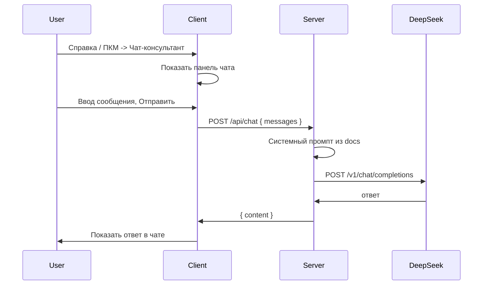

# План: чат-консультант с DeepSeek

## Цели

- Консультант открывается из меню **Справка** и по **ПКМ** (контекстное меню) с пунктом «Вызвать консультанта».
- Панель чата в интерфейсе приложения, запросы уходят на облачный API (ваш сервер вызывает DeepSeek).
- Контекст нейросети — документация программы (README, инструкции).
- Использовать **DeepSeek** (API OpenAI-совместимый: `https://api.deepseek.com`, модель `deepseek-chat`).

## Архитектура

- Работа консультанта возможна только при настроенном адресе сервера (`CATTLE_TRACKER_API_BASE`). Если сервер не задан — при отправке сообщения показывать подсказку «Укажите адрес сервера в Настройках» (или скрывать пункты консультанта при отсутствии API).

## 1. Сервер: маршрут и DeepSeek

**Файлы:** [server/server.js](server/server.js), новый [server/routes/chat.js](server/routes/chat.js) (или [server/chat.js](server/chat.js)).

- Добавить маршрут `POST /api/chat`.
- Тело запроса: `{ messages: [{ role: "user"|"assistant"|"system", content: "..." }] }` (история чата). Сервер сам добавляет системное сообщение с контекстом из документации, клиент передаёт только диалог user/assistant.
- Контекст из документации: при старте сервера читать из корня проекта (или из папки `server/`) файлы:
  - [README.md](README.md)
  - [ИНСТРУКЦИЯ_РАБОТА_С_ДАННЫМИ.md](ИНСТРУКЦИЯ_РАБОТА_С_ДАННЫМИ.md)
  при необходимости — [MULTIPLATFORM.md](MULTIPLATFORM.md). Собрать один текст и подставлять в системный промпт вида: «Ты консультант по программе «Учёт коров». Отвечай только на вопросы по работе приложения. Документация: …».
- Вызов DeepSeek: `POST https://api.deepseek.com/v1/chat/completions`, заголовок `Authorization: Bearer <DEEPSEEK_API_KEY>`, тело в формате OpenAI (messages: system + переданные messages), модель `deepseek-chat`.
- API-ключ: переменная окружения `DEEPSEEK_API_KEY`. Если ключа нет — маршрут возвращает 503 с сообщением «Чат-консультант не настроен».
- Ответ сервера: `{ content: "текст ответа" }` (или `{ message: { content: "..." } }` по желанию). Обработка ошибок DeepSeek и таймаут (например 30 с).

## 2. Клиент: панель чата

**Файлы:** [index.html](index.html), [js/](js/) (новый модуль, например `js/chat-consultant.js`), [css/](css/) (стили для панели). Аналогично в [electron/](electron/) — либо общие файлы из корня (Electron грузит index.html из родителя), тогда дублирование только для electron-специфики.

- В разметке: блок панели чата (например боковая или нижняя панель, либо модальное окно). Элементы: контейнер сообщений (список), поле ввода, кнопка «Отправить», кнопка закрытия панели. Изначально панель скрыта (класс/атрибут).
- Логика в `chat-consultant.js`:
  - Функция открытия/закрытия панели (показать/скрыть блок, фокус в поле ввода).
  - Отправка: собрать историю (массив сообщений пользователя и ассистента), вызвать `fetch(CATTLE_TRACKER_API_BASE + '/api/chat', { method: 'POST', body: JSON.stringify({ messages }), headers: { 'Content-Type': 'application/json', 'Authorization': 'Bearer ' + token } })` (токен брать так же, как в [js/api-client.js](js/api-client.js)). При отсутствии `CATTLE_TRACKER_API_BASE` — не вызывать fetch, показать тост «Укажите адрес сервера».
  - Ответ отобразить в контейнере сообщений; при ошибке сети/5xx — сообщение об ошибке в чате или тост.
- Подключить скрипт и стили в [index.html](index.html) и в [electron/index.html](electron/index.html) (если Electron использует свой index).

## 3. Меню «Справка»

**Electron:** [electron/main.js](electron/main.js) — в `createAppMenu()` в подменю «Справка» добавить пункт «Чат-консультант» с `click`, который отправляет в renderer команду открыть панель чата. Для этого:

- В [electron/preload.js](electron/preload.js) добавить в `electronAPI` метод, например `openChatConsultant: () => ipcRenderer.invoke('open-chat-consultant')` или `send('open-chat-consultant')`.
- В main зарегистрировать `ipcMain.on('open-chat-consultant', () => mainWindow.webContents.send('open-chat-consultant'))` и в renderer подписаться на `open-chat-consultant` и вызывать функцию открытия панели из `chat-consultant.js`.

**Веб (без Electron):** в приложении нет отдельного меню «Справка» — только группы подменю. Добавить в группу «Настройки» кнопку «Чат-консультант» в [js/menu.js](js/menu.js) в `MENU_GROUPS.settings.buttons` (например `{ icon: '💬', text: 'Чат-консультант', onclick: "openChatConsultant()" }`). Функция `openChatConsultant()` — глобальная, реализована в `chat-consultant.js` и просто открывает панель чата.

Итог: в десктопе консультант открывается из Справка и из Настройки; в вебе — из Настройки.

## 4. Контекстное меню (ПКМ)

**Файлы:** тот же [js/chat-consultant.js](js/chat-consultant.js) (или отдельный маленький модуль, подключаемый рядом).

- Подписаться на `document.addEventListener('contextmenu', handler)` (или на контейнере основного контента, чтобы не перехватывать ПКМ в полях ввода).
- В обработчике: `event.preventDefault()`, показать своё контекстное меню — один пункт «Вызвать консультанта», по клику вызвать открытие панели чата и скрыть меню. Разметка: скрытый блок (абсолютное позиционирование), при ПКМ выставлять `left/top` из `event.clientX/clientY` и показывать блок; по клику вне или по выбору пункта — скрыть.
- Учесть, что в Electron при `contextIsolation: true` такой код выполняется в renderer — отдельное контекстное меню через Electron `Menu` в main не обязательно; единое HTML-контекстное меню проще и одинаково для веб и Electron.

## 5. Сводка изменений по файлам

| Место                                                        | Действие                                                                                                                                                  |
| ------------------------------------------------------------ | --------------------------------------------------------------------------------------------------------------------------------------------------------- |
| [server/server.js](server/server.js)                         | Подключить маршрут `/api/chat` (например `app.use('/api', chatRoutes)` или отдельный роут).                                                               |
| Новый server/routes/chat.js                                  | Логика загрузки docs, формирование системного промпта, запрос к DeepSeek, возврат `{ content }`.                                                          |
| server/package.json                                          | При необходимости добавить зависимость для HTTP-запросов (например `node-fetch` или встроенный `fetch` в Node 18+).                                       |
| index.html + electron/index.html                             | Разметка панели чата, подключение `chat-consultant.js` и CSS.                                                                                             |
| css/ (и electron/css/)                                       | Стили панели чата и контекстного меню.                                                                                                                    |
| js/chat-consultant.js (и electron/js/ при раздельной сборке) | Открытие/закрытие панели, отправка/приём сообщений, подписка на IPC «open-chat-consultant», обработчик contextmenu и показ пункта «Вызвать консультанта». |
| js/menu.js (и electron/js/menu.js)                           | В `settings.buttons` добавить «Чат-консультант» с `openChatConsultant()`.                                                                                 |
| electron/main.js                                             | В подменю «Справка» добавить пункт «Чат-консультант», по клику — IPC в renderer.                                                                          |
| electron/preload.js                                          | Добавить в `electronAPI` вызов для открытия чата и подписку на событие от main.                                                                           |

## 6. DeepSeek

- Эндпоинт: `https://api.deepseek.com/v1/chat/completions`.
- Модель: `deepseek-chat`.
- Заголовок: `Authorization: Bearer <DEEPSEEK_API_KEY>`.
- Тело как у OpenAI: `{ model, messages: [{ role, content }, ...], max_tokens }`. Ключ хранить только на сервере в `process.env.DEEPSEEK_API_KEY`.

## 7. Безопасность и ограничения

- Не передавать в чат персональные данные стада или логины/пароли; в системном промпте явно указать «не запрашивай и не обрабатывай персональные данные пользователей».
- Лимит длины истории (например последние N сообщений или ограничение по токенам) на сервере, чтобы не превышать лимиты DeepSeek и не раздувать запросы.

